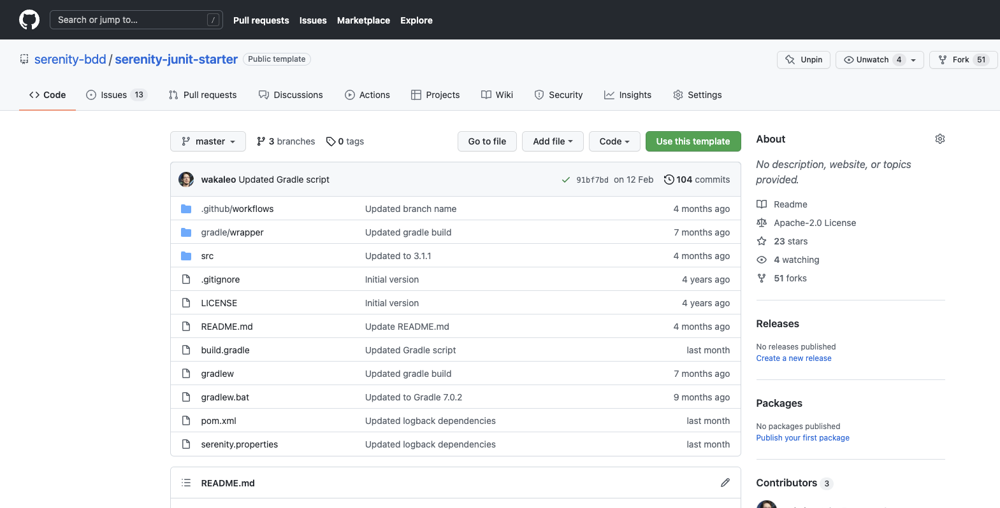
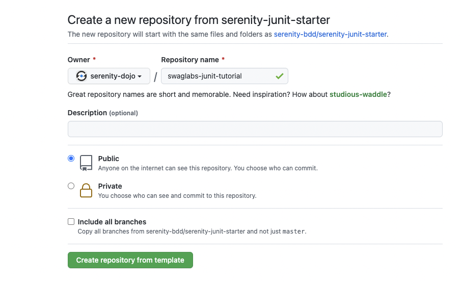
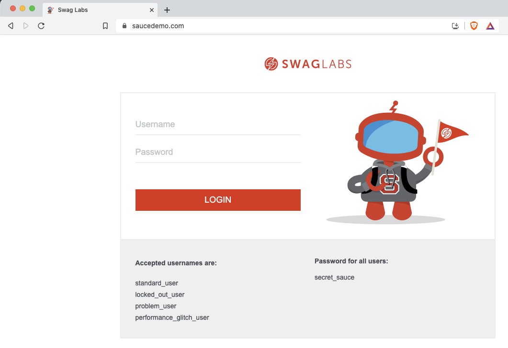
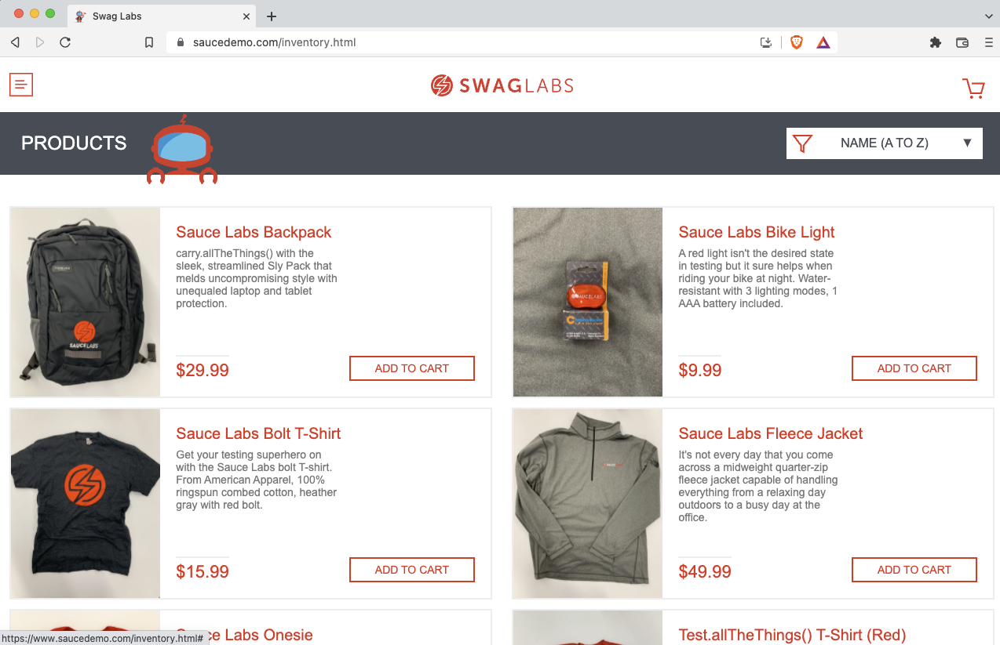
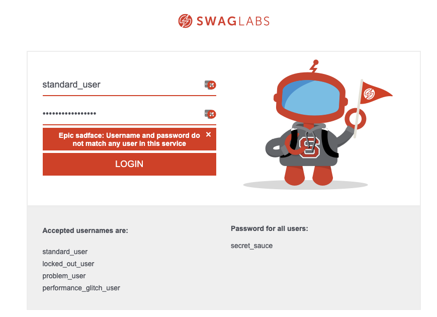
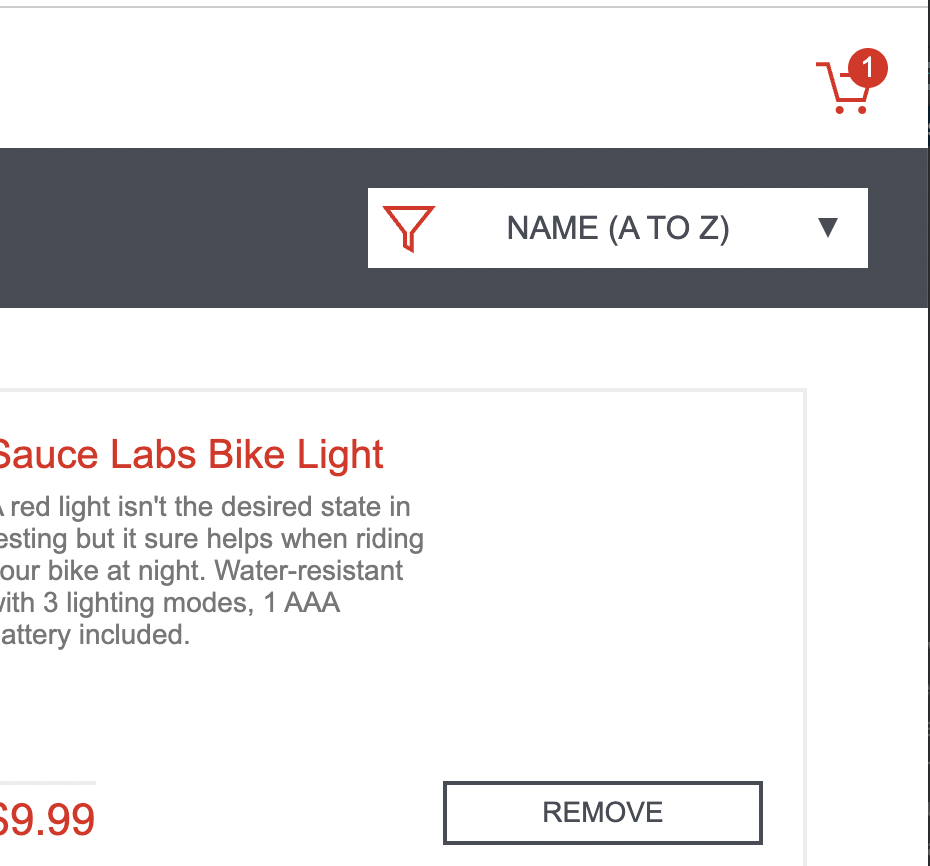
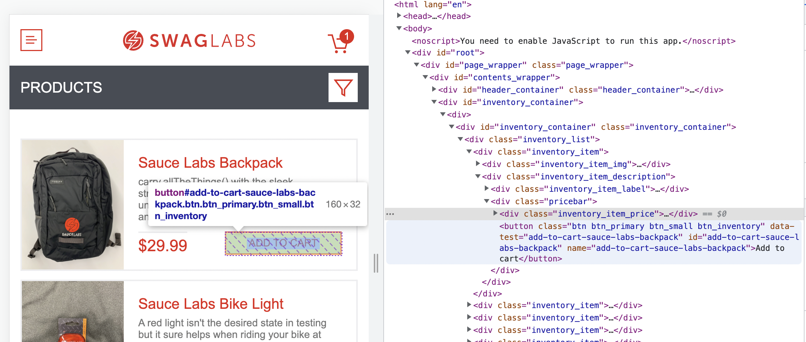

# Serenity Dojo Test Automation Challenge: UI tests using JUnit 5 and Serenity BDD

In this tutorial, you will build a complete set of end-to-end acceptance tests running against the [Swaglabs SauceDemo](https://www.saucedemo.com/) website, using Serenity BDD and the Action Classes pattern.

## Getting Started - Create a starter project
Start your project by creating a new Github repository using the [serenity-junit-starter](https://github.com/serenity-bdd/serenity-junit-starter) template project.



Click on the "Use This Template" button and create your own skeleton project.



Load this project into your IDE (IntelliJ is recommended). Delete the sample test package in `src/test/java/starter` and create a new package for your project called `src/test/java/swaglabs`. Inside this package, create two nested packages: `features`, for your test cases, and `actions`, for your test automation code.

```
src
  - test
    - java
      - swaglabs
         - features
         - actions
    - resources
      - serenity.conf
pom.xml       
```

The `serenity.conf` file contains the configuration details about your test suite. For JUnit tests, you need to set the `serenity.test.root` property to the root package containing your test cases. For this project, make sure that the `serenity.conf` file contains the following line:

```
serenity.test.root = swaglabs.features
```

By default, the tests will run in headless mode. If you would like to see the tests running in an actual browser, set the `headless.mode` property to `false`:
```
headless.mode = false
```

## Lesson 1 - Logging on

We will start by testing the application login page.



The goal will be to log in using the `standard_user` username and check that the product list is displayed.



### Step 1 - the skeleton test

Start by creating a new test package called `authentication`, inside the `swaglabs/features` package. class

```java
package swaglabs.features.authentication;

import net.serenitybdd.junit5.SerenityJUnit5Extension;
import org.junit.jupiter.api.Test;
import org.junit.jupiter.api.extension.ExtendWith;

@ExtendWith(SerenityJUnit5Extension.class)
public class WhenLoggingOn {

    @Test
    public void withValidCredentials() {
    }
}
```

### Step 2 - the Login action

Now we need to open the Swaglabs site and enter valid credentials. We will do this in a reusable Action class called `LoginActions`. Use the `@Steps` annotation to add this class to your test:

```java
@ExtendWith(SerenityJUnit5Extension.class)
public class WhenLoggingOn {

    @Steps
    LoginActions login;

    @Test
    public void withValidCredentials() {
        login.withCredentials("standard_user","secret_sauce");
        assertThat(inventoryList.itemNames()).isNotEmpty();
    }
}
```

Now create this new class in the `swaglabs.actions.authentication` package. A simple implementation could look like this one:

```java
package swaglabs.actions.authentication;

import net.serenitybdd.core.steps.UIInteractions;
import net.thucydides.core.annotations.Step;

public class LoginActions extends UIInteractions {
    @Step("Log in to the Swaglabs application as {0}")
    public void withCredentials(String username, String password) {
        openUrl("https://www.saucedemo.com/");
        $("#user-name").sendKeys(username);
        $("#password").sendKeys(password);
        $("#login-button").click();
    }
}
```

Now run the test to make sure it runs correctly.

### Step 3 - check the results

The final step of this test is to check that we arrive on the product page. There are many ways we could do this. To keep things simple, we will simply check that the "Products" title appears. To do this, we will create a Page Component class called `PageHeader` to represent the header section that appears on each page of the application.

Since this is a common class, we can place it in a `common` package. A sample implementation could look like this:

```java
package swaglabs.actions.common;

import net.serenitybdd.core.pages.PageComponent;

public class PageHeader extends PageComponent {
    public String title() {
        return $(".title").getText();
    }
}
```

Now add this class to your test class (you don't need to use the `@Steps` annotation for page objects or page components)

```java
@ExtendWith(SerenityJUnit5Extension.class)
public class WhenLoggingOn {

    @Steps
    LoginActions login;

    PageHeader pageHeader;

    @Test
    public void withValidCredentials() {
        login.withCredentials("standard_user","secret_sauce");

        assertThat(pageHeader.title()).isEqualToIgnoringCase("Products");
    }
}
```

Now run the test again to make sure it works.

## Lesson 2 - Logging on with invalid credentials

Next we will write a test that checks what happens if we enter the wrong password. This will result in an error message on the login page like the following:



To test this behaviour, we can reuse our `login` action class in this test, so the first part of the test will be similar to our first test:

```java
@Test
public void withInvalidCredentials() {
    login.withCredentials("standard_user","wrong_password");
}
```

Next, we need to check the error message that appears. Add a method to the `LoginActions` class to return the text of this message. A sample implementation could look like this:

```java
public String errorMessage() {
    return $("[data-test='error']").getText();
}
```

Now update the test to check the error message:

```java
@Test
public void withInvalidCredentials() {
    login.withCredentials("standard_user","wrong_password");

    assertThat(login.errorMessage()).contains("Username and password do not match");
}
```

## Lesson 3 - Implement a data-driven test

JUnit 5 makes it easy to test different combinations of data using _Parameterized Tests_. Turn the previous test into a data-driven test that checks the correct error messages for the following scenarios:
- Invalid password
- Locked out user (use the `locked_out_user` username)
- Missing password
- Missing username

A JUnit 5 parameterised test to do this might look like this:

```java
@ParameterizedTest
@CsvSource(delimiterString = "|", value = {
        "standard_user  | wrong_password    | Username and password do not match",
        "locked_out_user| secret_sauce      | Sorry, this user has been locked out",
        "standard_user  | ''                | Password is required",
        "''             | secret_sauce      | Username is required"
})
public void withInvalidCredentials(String username, String password, String errorMessage) {
    login.withCredentials(username, password);

    assertThat(login.errorMessage()).contains(errorMessage);
}
```

Note how we don't need to add any new test code - we are just reusing existing methods.

## Lesson 4 - Check the products displayed on the product page

Let's see what happens when we get to the product page after logging in. The product page looks like this:


The next thing we need to check is that all of the expected products appear on the catalog page. In a real application, we might compare the products with the ones we expect from an API or database query, but here we can assume they are constant.

Create a new test class called `WhenBrowsingTheCatalog`, in a new `swaglabs.features.catalog` package. The skeleton test could look like this:

```java
@ExtendWith(SerenityJUnit5Extension.class)
class WhenBrowsingTheCatalog {

    @Steps
    LoginActions login;

    @BeforeEach
    void login() {
        login.asAStandardUser();
    }

    @Test
    void shouldSeeAllInventoryProducts() {
        // TODO: Complete this test
    }
}
```

Now let's add the `asAStandardUser()` method to the `LoginActions` class, so we don't need to copy the username and password each time:

```java
public class LoginActions extends UIInteractions {
    .
    .
    .
    @Step("Log in as a standard user")
    public void asAStandardUser() {
        withCredentials("standard_user","secret_sauce");
    }
}
```

Next, try to implement the `shouldSeeAllInventoryProducts()` method, using an action class called `CatalogActions`. A sample solution is shown here:

```java
@Test
void shouldSeeAllInventoryProducts() {
    assertThat(catalog.productTitles()).contains(
            "Sauce Labs Backpack",
            "Sauce Labs Bolt T-Shirt",
            "Sauce Labs Onesie",
            "Sauce Labs Bike Light",
            "Sauce Labs Fleece Jacket",
            "Test.allTheThings() T-Shirt (Red)"
    );
}
```

In the `CatalogActions` class, you could use the `findAll()` or `$$()` method to find al of the matching product names on the page:

```java
public class CatalogActions  extends UIInteractions {

    public List<String> productTitles() {
        return findAll(".inventory_item_name").texts();
    }
}
```

For the next test, we want to check that each product on the catalog page has a description, a title and a price.

One way to do this would be to create a method in our `CatalogActions` class to return a list of product details, and to then use the AssertJ `allMatch()` method to check the properties of each product. For example, we could create a `ProductInfo` Java record to represent information about a displayed product:

```java
public record ProductInfo(String title, String description, double price) {}
```

The `products()` method in the `CatalogActions` class should read all the product details displayed on the catalog page, and convert them to a list of `ProductInfo`s, for example:

```java
public List<ProductInfo> products() {
    return findAll(".inventory_item_description")
            .map(item -> {
               String title = item.findBy(".inventory_item_name").getText();
               String description = item.findBy(".inventory_item_desc").getText();
               double price = Double.parseDouble(item.findBy(".inventory_item_price").getText().replace("$",""));
               return new ProductInfo(title, description, price);
            });
}
```

Finally, the test itself could use the AssertJ `allMatch()` method to check the properties of each product:

```java
@Test
void eachProductShouldHaveADescriptionAndAPrice() {
    assertThat(catalog.products()).allMatch(
            item -> !item.description().isEmpty() && !item.title().isEmpty() && item.price() > 0
    );
}
```

Our last test on this page should check that each image is unique. We could do this by building on the ProductInfo record, so that it also contains the image of the product, e.g.

```java
public record ProductInfo(String title, String description, double price, String image) {}
```

Try to modify the `products()` method to extract the image as well as the other attributes. One possible solution could be the following:

```java
public List<ProductInfo> products() {
    return findAll(".inventory_item_description")
            .map(item -> {
               String title = item.findBy(".inventory_item_name").getText();
               String description = item.findBy(".inventory_item_desc").getText();
               String image = item.findBy(".img.inventory_item_img").getAttribute("src");
               double price = Double.parseDouble(item.findBy(".inventory_item_price").getText().replace("$",""));

               return new ProductInfo(title, description, price, image);
            });
}
```

Now, write a test that checks whether each image on the page is unique. One possiblity might be the following:

```java
@Test
void eachProductShouldHaveADifferentImage() {
    List<String> productImages = catalog.products().stream().map(ProductInfo::image).toList();
    assertThat(productImages).doesNotHaveDuplicates();
}
```

## Lesson 5 - Adding an item to the cart

For the next test, we will try adding some items from the catalog to the shopping cart. Create a new `cart` package, and in it create a test class called `WhenAddingItemsToTheCart`. 

Start by creating a new test class, `WhenAddingItemsToTheCart`, in a new package called `cart` (underneath the `features` package). 

### Checking the initial cart count
The first test should simply check that the shopping cart badge is initially empty. 



Use a Page Component class to represent the shopping cart icon element on the page. The test could look something like this:

```java
    ShoppingCartIcon shoppingCartIcon;

    @Test
    @DisplayName("the cart should initially be empty")
    void cartShouldInitiallyBeEmpty() {
        assertThat(shoppingCartIcon.itemCount()).isEmpty();
    }
```

The `ShoppingCartIcon` class should be a Page Component class, and so should extend the `et.serenitybdd.core.pages.PageComponent` class:
```java
public class ShoppingCartIcon extends PageComponent {
}
```

The `itemCount()` method should return a String (because it could be empty). One possible implementation would be the following:
```java
public class ShoppingCartIcon extends PageComponent {
    public String itemCount() {
        return $(".shopping_cart_link").getText();
    }
}
```

### Adding an item

The next test will check that the shopping cart badge is updated with the right number of items when you add an item to the cart. Write a test that will click on the "Add to cart" button of one of the catalog items, and check that the number in the badge updates to one.

In addition to the `ShoppingCartIcon` component we just created, we will also need an action class to add an Action Class to click on the "Add to cart" button of the product we want. The test could look like this one:

```java
    @Steps
    CartActions cart;

    @Test
    @DisplayName("the item count should represent the number of items currently in the cart")
    void addingAnItemShouldUpdateTheItemCount() {
        cart.addItem("Sauce Labs Backpack");
        assertThat(shoppingCartIcon.itemCount()).isEqualTo("1");
    }
```

The `addItem()` method needs to locate the right "Add to cart" button. Inspect the page structure and see if you can figure out how to locate a given "Add to cart" button:

 

One way would be to use Serenity Page Elements. Page Elements let you locate elements that match certain conditions, including what text they contain, and what other elements they are inside. In this case, each  product is represented by a `div` with the `inventory_item` class. For example we could locate the `div` for a given product by using the following expression:

```java
PageElement.containingText(".inventory_item","Sauce Labs Backpack")))
```

The "Add to cart" button is an HTML `button` element. We can match any "add to cart" button with the following expression:
```java
Button.withText("Add to cart")
```

But if we want the button that is inside a particular product `div` element, we can use the `inside()` method. So the final `addItem()` method will look like this:

```java
public class CartActions extends UIInteractions {

    @Step
    public void addItem(String itemName) {
        $(Button.withText("Add to cart")
                .inside(PageElement.containingText(".inventory_item",itemName)))
                .click();
    }
}
```


